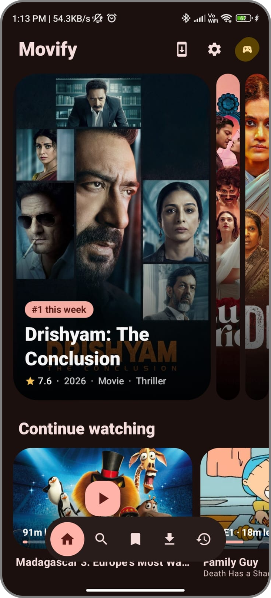
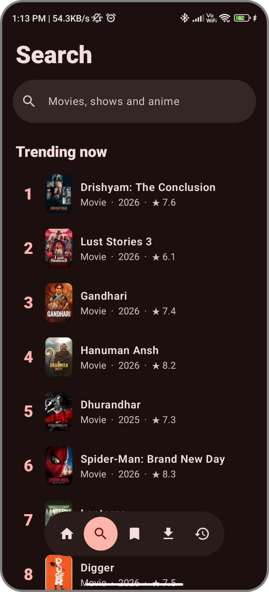
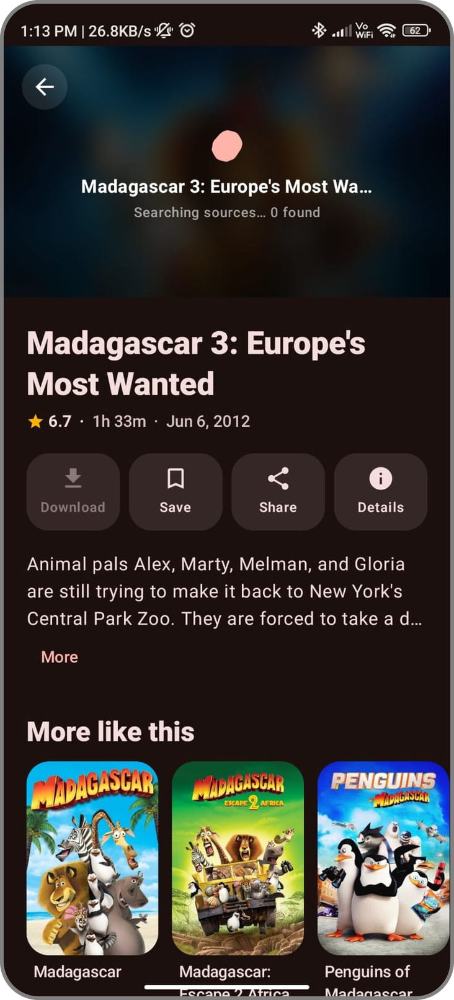
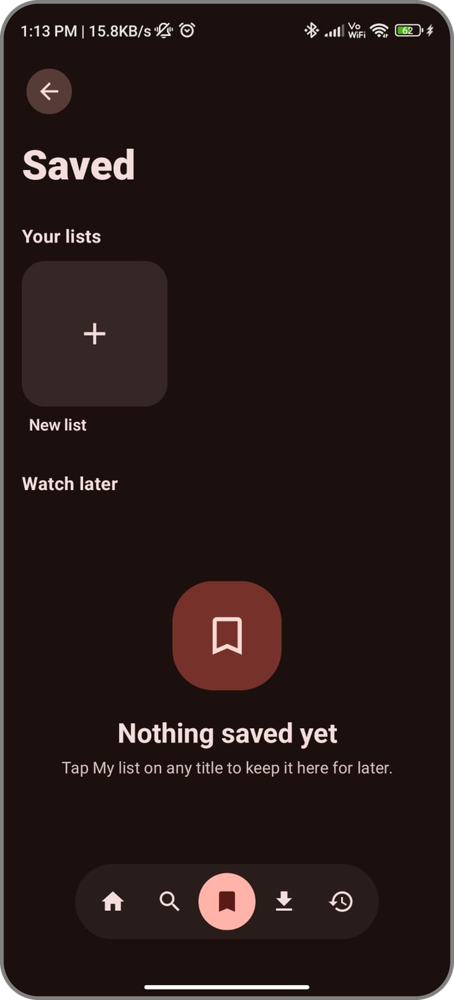
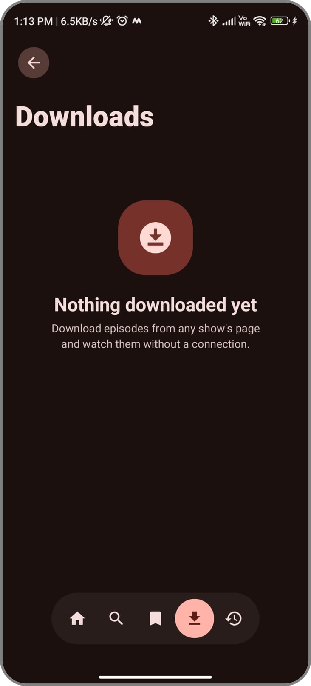
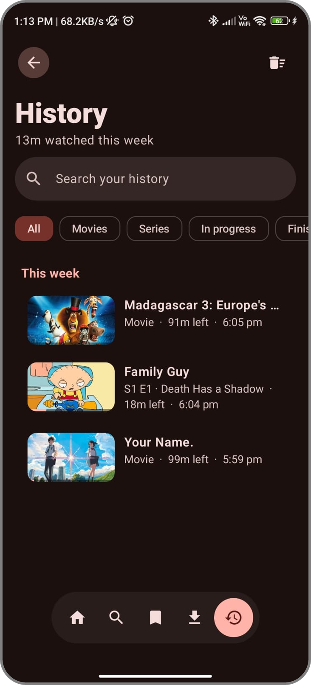

<div align="center">


# Movify

### Movies, series and anime in one native Android app

<br/>

[](https://github.com/scisims12/Movify/releases/latest)
[](https://github.com/scisims12/Movify/releases)
[](https://github.com/scisims12/Movify)
[](LICENSE)

<br/>

[**Download**](#download-now) ·
[**Features**](#features) ·
[**Screenshots**](#screenshots) ·
[**Installation**](#installation) ·
[**FAQ**](#faq) ·
[**License**](#license)

</div>

---

<div align="center">

## About Movify

**Movify** is a modern Android app for discovering and watching movies, series and anime.

Browse what's trending, pick up where you left off, and watch with a real player: quality switching, subtitles, dubs, downloads and picture-in-picture, all inside one clean Material 3 Expressive interface.

**Trending Shelves · Smart Search · Powerful Player · Offline Downloads · Dynamic Color**

</div>

---

<div align="center">

<h1 id="screenshots">Screenshots</h1>





<br/>





</div>

---

<div align="center">

<h1 id="features">Features</h1>

<table>
  <tr>
    <td width="50%" valign="top">

### 🏠 Discover

- Trending carousel and Top 10
- New episodes this week
- Popular movies, series and anime
- Curated shelves on Home

</td>
    <td width="50%" valign="top">

### 🔍 Search

- Search as you type
- Filters and genres
- Trending picks
- Recent searches

</td>
  </tr>

  <tr>
    <td width="50%" valign="top">

### 🎬 Title Pages

- Seasons and episodes
- Cast information
- Trailers
- Similar titles

</td>
    <td width="50%" valign="top">

### ▶️ Player

- Quality switching (up to 4K when available)
- Subtitles in many languages
- Audio selection: original, dub or other languages
- Mini player and picture-in-picture

</td>
  </tr>

  <tr>
    <td width="50%" valign="top">

### ⏯️ Continue Watching

- Resume from the exact spot
- Next episode lined up for you
- Auto-play next episode
- Watched marks on finished episodes

</td>
    <td width="50%" valign="top">

### 📥 Downloads

- Download an episode or a whole season
- Pause, resume and retry
- Play offline

</td>
  </tr>

  <tr>
    <td width="50%" valign="top">

### 📚 Saved & History

- Saved list and History
- Search, filters and sorting in each
- Quick access to what you love

</td>
    <td width="50%" valign="top">

### 🎨 Interface

- Material 3 Expressive design
- Dynamic color on Android 12+
- Themed app icon
- Layouts for phones, tablets and landscape

</td>
  </tr>
</table>

</div>

---

<div align="center">

<h1 id="download-now">Download Now</h1>

<a href="https://github.com/scisims12/Movify/releases/latest">
  
</a>

<br/><br/>

<a href="https://github.com/scisims12/Movify/releases/latest">
  
</a>

<br/><br/>

<a href="https://github.com/scisims12/Movify/releases">View all GitHub releases</a>

</div>

---

<div align="center">

<h1 id="installation">Installation</h1>

</div>

1. Open the **Releases** section.
2. Select the latest Movify release.
3. Download the APK file (`universal` works on every phone).
4. Open the downloaded APK.
5. Allow installation from the required source if Android asks.
6. Install Movify.
7. Open the app and start watching.

> Always download Movify from the official GitHub repository.

---

<div align="center">

# How Streams Work

</div>

Movify does not host any video. Titles and artwork come from [TMDB](https://www.themoviedb.org/). Streams come from **source extensions** listed in a JSON catalog. The app checks every installed source in parallel, ranks the results and plays the best one. If a source fails, it moves on to the next.

Not every title is available, and coverage depends on the sources added. Want to add one? See the [extension contributor guide](extensions/README.md) and the [catalog format](docs/EXTENSIONS.md).

---

<div align="center">

# Building From Source

</div>

### Requirements

- Android Studio (or JDK 17 and the Android SDK)
- A free [TMDB API key](https://www.themoviedb.org/settings/api)
- Internet connection for dependencies

### Steps

```bash
git clone https://github.com/scisims12/Movify.git
cd Movify
echo "TMDB_API_KEY=your_key_here" >> local.properties
./gradlew installDebug
```

Or open the project in **Android Studio**, let Gradle sync, and run it on a device or emulator. Without a key the app falls back to TMDB's `DEMO_KEY`, which is heavily rate-limited.

---

<div align="center">

# Tech Stack

</div>

| Area | What's used |
| --- | --- |
| UI | Jetpack Compose, Material 3 Expressive |
| Language and build | Kotlin, Gradle version catalog |
| Architecture | Single activity, Navigation Compose, MVVM with `StateFlow`, Hilt |
| Data | Retrofit, OkHttp, kotlinx-serialization, Room, Coil 3 |
| Playback | Media3 ExoPlayer (HLS and MP4), Media3 download service, WebView fallback for web sources |

Architecture notes and conventions are in [CLAUDE.md](CLAUDE.md).

---

<div align="center">

# Security

</div>

Sensitive information should never be committed to the public repository.

Do not upload files such as:

- `.env`
- `local.properties`
- `key.properties`
- `.jks`
- `.keystore`
- private API keys
- access tokens
- passwords
- signing credentials

If a secret is accidentally published, revoke or rotate it immediately.

---

<div align="center">

<h1 id="faq">FAQ</h1>

</div>

### Where can I download the latest version?

[**Download the latest Movify release**](https://github.com/scisims12/Movify/releases/latest)

### Does Movify support offline playback?

Yes. You can download episodes or a whole season and watch them offline.

### Does Movify support subtitles and dubs?

Yes. Subtitles come from the stream or OpenSubtitles, and you can pick another audio language when a source provides it.

### Why is a title not available?

Streams come from source extensions, so availability depends on the installed sources.

### Where can I report a problem?

Use the GitHub Issues section.

[**Open an Issue**](https://github.com/scisims12/Movify/issues)

---

<div align="center">

# Bug Reports

</div>

If you find a bug, please include:

- Movify version
- Android version
- Device model
- Description of the issue
- Steps to reproduce
- Screenshot or screen recording if possible

[**Report a Bug**](https://github.com/scisims12/Movify/issues)

---

<div align="center">

# Contributing

</div>

Bug reports, fixes and new sources are welcome. Start with [CONTRIBUTING.md](CONTRIBUTING.md).

---

<div align="center">

<h1 id="license">License</h1>

</div>

Movify is released under the [MIT License](LICENSE).

---

<div align="center">

# Acknowledgments

</div>

- Based on and uses components from [OpenStream](https://github.com/Ivorisnoob/OpenStream) (MIT License, Copyright (c) 2026 Ivor).
- [TMDB](https://www.themoviedb.org/) for metadata and artwork. This product uses the TMDB API but is not endorsed or certified by TMDB.
- [OpenSubtitles](https://www.opensubtitles.org/) for subtitles.
- [Material 3 Expressive](https://m3.material.io/) for the design system.
